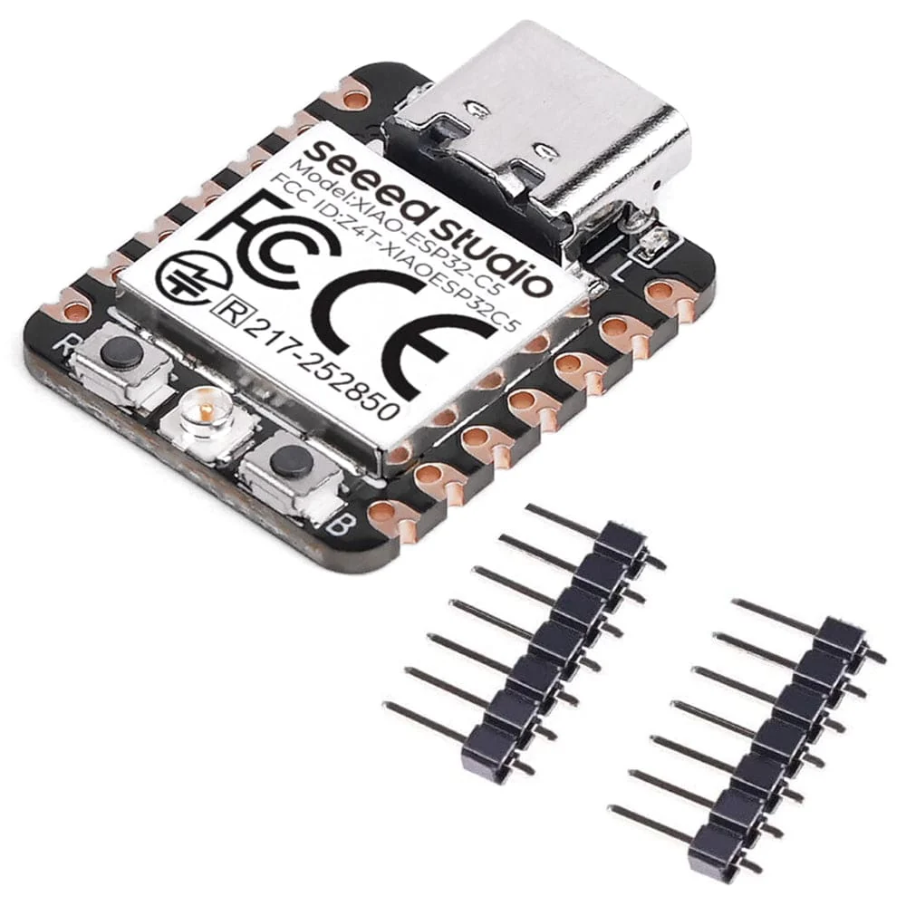
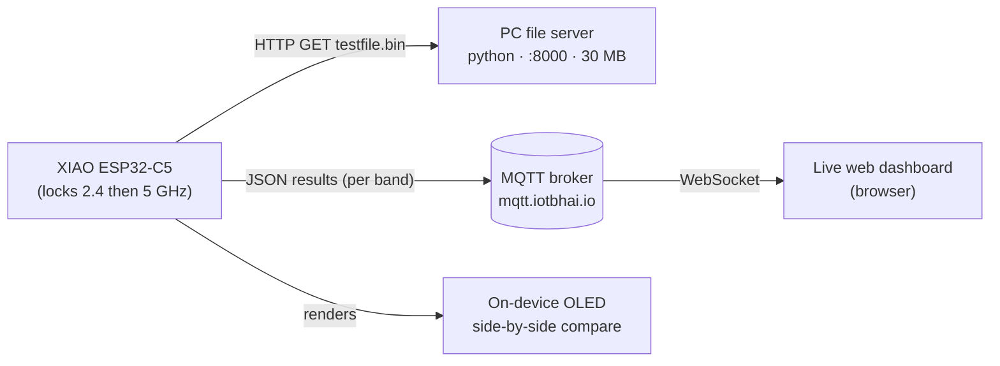
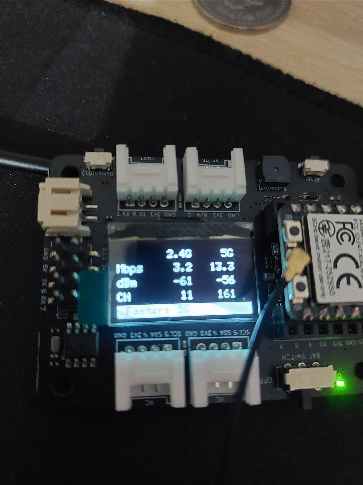

<div align="center">



# XIAO ESP32-C5 · 2.4 GHz vs 5 GHz Live Benchmark

**Watch the first dual-band ESP32 race its own two Wi-Fi bands — on an OLED and a live web dashboard.**


</div>

---

## 📖 What is this?

The **Seeed Studio XIAO ESP32-C5** is the first ESP32 with **dual-band Wi-Fi 6 (2.4 GHz + 5 GHz)**. This project makes the C5 **benchmark both bands back-to-back** and shows the comparison two ways:

- **On the device** — a 128×64 OLED cycles `2.4 GHz → 5 GHz → side-by-side result`, with a live download progress bar and a “Faster” verdict.
- **On a browser** — a modern, dark **live dashboard** subscribes to the board's MQTT stream and renders a head-to-head arena (throughput race bars, signal meters, a winner banner, and a live chart).

It was built for the IoT Bhai YouTube video **“2.4 GHz vs 5 GHz on the ESP32-C5 — The Real Difference.”**

---

## 🧩 Repository structure

```
.
├── xiao_c5_dualband_node/          # ⭐ Main firmware: auto 2.4-vs-5 comparison
│   ├── xiao_c5_dualband_node.ino
│   ├── arduino_secrets.h.example   #   → copy to arduino_secrets.h & fill in
│   └── arduino_secrets.h           #   (git-ignored) your real Wi-Fi creds
├── xiao_c5_hardware_test/          # First-upload sanity test (LED + OLED + I2C)
│   └── xiao_c5_hardware_test.ino
├── throughput_server/              # PC-side HTTP server for the download test
│   └── serve_testfile.py           #   creates a 30 MB file and serves it
├── Dashboard/                      # Live MQTT web dashboard (open in a browser)
│   └── xiao_c5_dualband_dashboard.html
├── images/                         # README assets
└── README.md
```

---

## 🔧 Hardware

| Part | Notes |
|------|-------|
| **Seeed Studio XIAO ESP32-C5** | The dual-band Wi-Fi 6 board under test |
| **XIAO Expansion Base** | Carries the SSD1306 **OLED @ 0x3C** (on **D4=SDA / D5=SCL**) |
| **USB-C cable** | Power + flashing + Serial monitor |
| A Wi-Fi router with **2.4 GHz and 5 GHz** | Split SSIDs or one dual-band SSID both work |
| A PC on the **same network** | Runs the throughput file server |

> The Expansion Base wires the OLED to **GPIO23 (SDA)** and **GPIO24 (SCL)** — not the chip's default I²C pins. The firmware sets these explicitly.

---

## 🛰️ How it works



Each cycle the firmware:
1. **Locks the radio to one band** with `esp_wifi_set_band_mode()` and connects to that band's SSID.
2. Records **connect time, RSSI, channel**.
3. **Downloads a 30 MB file** from the PC server, counting bytes as they stream (nothing is stored on the chip) → **Mbps**, with a live % + speed on the OLED.
4. **Publishes the result** as JSON to MQTT.
5. Repeats for the other band, then shows the **comparison + winner** and holds it for filming.

---

## 🚀 Quick start

### 1) Flash the firmware

- **Arduino IDE** with the **arduino-esp32 core v3.1.0+**, board **`XIAO_ESP32C5`**
- Libraries (Library Manager): **U8g2**, **PubSubClient**
- In `xiao_c5_dualband_node/`, **copy `arduino_secrets.h.example` → `arduino_secrets.h`** and fill in your Wi-Fi:

```cpp
#define SECRET_WIFI_SSID_24  "YOUR_2G_SSID"
#define SECRET_WIFI_SSID_5   "YOUR_5G_SSID"
#define SECRET_WIFI_PASS     "YOUR_WIFI_PASSWORD"
```

> 🧪 First time with the board? Flash **`xiao_c5_hardware_test`** first — it should blink the LED, print `device found at 0x3C`, and show text on the OLED.

### 2) Start the throughput server (on your PC)

```bash
cd throughput_server
python serve_testfile.py
```

It creates a **30 MB** `testfile.bin` (once) and prints the URL to use, e.g. `http://192.168.0.197:8000/testfile.bin`. Leave the window open. Then set that URL in the firmware:

```cpp
const char* THROUGHPUT_URL = "http://<YOUR-PC-LAN-IP>:8000/testfile.bin";
```

> **Firewall:** if the board can't reach the server, allow the port once (Admin PowerShell):
> ```
> netsh advfirewall firewall add rule name="C5 throughput 8000" dir=in action=allow protocol=TCP localport=8000
> ```

### 3) Open the live dashboard

Open **`Dashboard/xiao_c5_dualband_dashboard.html`** in any browser. It auto-connects to `ws://mqtt.iotbhai.io`, topic `iotbhai/c5/bench`. Use the **⚙** button to change the broker/topic.

> ℹ️ Keep it as a **local file** — browsers can only reach MQTT over **WebSocket**, and your broker needs a WS listener enabled. If it shows a connection error, try `ws://<host>:9001` or `ws://<host>/mqtt` via the ⚙ settings.

---

## 📡 Wi-Fi bands & the split-SSID gotcha

Many routers broadcast a **separate name per band** (e.g. `IoT Bhai` = 2.4 GHz, `IoT Bhai_5G` = 5 GHz). If you lock the radio to 5 GHz but point it at the 2.4 GHz name, **it will never connect** — the 5 GHz radio can't see a 2.4 GHz network.

This firmware handles it: it **auto-selects the SSID that matches the band** it's testing. If instead you use a **single merged dual-band SSID** (router “Smart Connect” / band steering), just set both SSID fields to that one name.

---

## ⚙️ Configuration reference

`xiao_c5_dualband_node.ino` (top of file):

| Setting | Default | Meaning |
|--------|---------|---------|
| `THROUGHPUT_URL` | `http://192.168.0.197:8000/testfile.bin` | Test file on your PC |
| `RUN_THROUGHPUT` | `true` | Set `false` to skip the download test |
| `CONNECT_TIMEOUT_MS` | `20000` | Give up connecting after this |
| `THROUGHPUT_MAX_MS` | `120000` | Hard stop per download |
| `COMPARE_HOLD_MS` | `20000` | How long the result screen stays (for filming) |
| `MQTT_HOST` / `MQTT_TOPIC` | `mqtt.iotbhai.io` / `iotbhai/c5/bench` | Where results are published |

`throughput_server/serve_testfile.py`: `SIZE_MB = 30`, `PORT = 8000`.

**MQTT payload** (per band):
```json
{ "band":"5G", "ok":true, "channel":161, "rssi":-63, "connect_ms":1240, "mbps":15.9, "ip":"192.168.0.144" }
```

---

## 📟 OLED screens

<div align="center">

<br>
<em>The real comparison screen — 5 GHz wins on both throughput and signal here.</em>
</div>

The firmware cycles through three screens per run:

```
 Testing 5G          5G   47%          2.4G     5G
 downloading...      15.8 Mbps    Mbps  22.4   15.8
 IoT Bhai_5G         [█████░░░░]   dBm    -48    -66
                                  CH        6    161
                                  ▐ Faster: 5G ▌
   (connect)         (progress)     (comparison)
```

---

## 🎯 Accuracy note for the comparison

Raw throughput on the ESP32-C5 is **capped by the chip (~15–40 Mbps)**, not the air link — so 5 GHz may **not** look dramatically faster in Mbps. The honest, visible differences on this hardware are:

- **RSSI / range** — 2.4 GHz reaches further and through walls; 5 GHz is faster **up close** but weaker at distance.
- **Channel & congestion** — 2.4 GHz is crowded (ch 1–11); 5 GHz is clean (ch 36–161).

For the best 5 GHz numbers, keep the board **near the router** during its run.

---

## 🩺 Troubleshooting

| Symptom | Fix |
|--------|-----|
| `WiFi FAILED` on OLED | SSID/band mismatch — check `arduino_secrets.h`; the SSID must exist on the locked band |
| Throughput stuck at `0.00` | Server not running, wrong `THROUGHPUT_URL`, or **firewall** blocking port 8000 |
| OLED blank / no `0x3C` | Reseat the XIAO on the Base; I²C is on D4/D5, set in code |
| Dashboard “connection error” | Broker has no WebSocket listener, or wrong WS port/path — try `:9001` or `/mqtt` |
| `[mqtt] FAIL` in Serial | Broker unreachable — harmless; throughput + OLED still work |

---

## 🙌 Credits

Built by **IoT Bhai** for the video *“2.4 GHz vs 5 GHz on the ESP32-C5 — The Real Difference.”*
Hardware: Seeed Studio XIAO ESP32-C5 · Libraries: [U8g2](https://github.com/olikraus/u8g2), [PubSubClient](https://github.com/knolleary/pubsubclient), [MQTT.js](https://github.com/mqttjs/MQTT.js), [Chart.js](https://www.chartjs.org/).

## 📄 License

[MIT](LICENSE) © IoT Bhai
